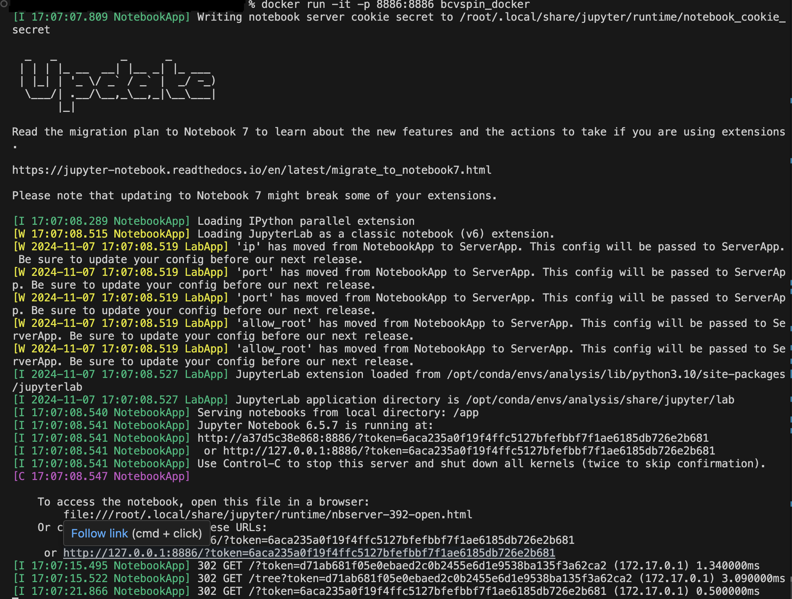

# BCVSPIN2024 Machine Learning Workshop, Nepal

Data can be found in this folder.

https://drive.google.com/drive/folders/13qalvy6xVAUsEnOjU7T4qZb149bLMN1F?usp=sharing


# Workshop Docker environment Setup : Installation and Usage

This guide will walk you through the installation of Docker on your system (Windows, Linux, or macOS) and how to load and run a Docker image from a `.tar` file.

## Prerequisites

Before you start, make sure you have the following:
- Internet access to download Docker and the Docker image `.tar` file.
- Administrative rights to install software on your system.


## 1. Install Docker

### On Windows

1. **Download Docker Desktop for Windows**  
   Visit the official Docker website and download the latest version of Docker Desktop for Windows:  
   [Docker Desktop for Windows](https://www.docker.com/products/docker-desktop)

2. **Install Docker Desktop**  
   Run the installer and follow the on-screen instructions. Once installed, Docker Desktop will start automatically.

3. **Verify Installation**  
   Open PowerShell or Command Prompt and type:
   ```bash
   docker --version
4. **Start Docker**
    Docker should automatically start when you launch the Docker Desktop application. If it doesn't, manually start it from the Start menu.

### On Linux

1. **Install Docker using APT (Debian/Ubuntu-based systems)**
    Open a terminal and run the following commands to install Docker:
    ```bash
    sudo apt-get update
    sudo apt-get install docker.io

2. **Start Docker Service**
    Enable and start Docker:
   ```bash
   sudo systemctl enable docker
   sudo systemctl start docker

3. **Verify Installation**
    Check Docker's installation by running:
   ```bash
   docker --version
4. **Add User to Docker Group (Optional)**
   To run Docker without sudo, add your user to the Docker group:
     ```bash
    sudo usermod -aG docker $USER
     ```  
5. **Reboot**
   Log out and log back in to apply the group changes.

### On macOS

1.  **Download Docker Desktop for Mac**
    Visit the official Docker website and download the latest version of Docker Desktop for macOS:
[Docker Desktop for Mac](https://docs.docker.com/desktop/setup/install/mac-install/)

2.  **Install Docker Desktop**
    Open the downloaded .dmg file and drag Docker to the Applications folder.

3. **Verify Installation**
    Open Terminal and run the following command:
   ```bash
   docker --version
4. **Start Docker**
    Launch Docker from the Applications folder. Docker will start automatically.

## 2. Load Docker Image from .tar File

1. Download the Docker Image from this [link](https://cernbox.cern.ch/s/PVGpyzM0lKv5o5j)  
   After downloading, save the file to a known location.
   
2. To load the Docker Image:

   1. Open Terminal (or Command Prompt on Windows)
   2. Navigate to the directory where you downloaded the .tar file.
   3. Run the following command to load the .tar file into Docker:
   ```bash
    docker load -i bcvspin_docker.tar
3. Verify the Image
 
  To ensure the image has been loaded correctly, run:
  ```bash
  docker images
  ```

## 3. Run the Docker Image

1. **Run the Docker Image**

   To start a container from the loaded Docker image, use the following command:
   ```bash
   docker run -it -p 8886:8886 bcvspin_docker
  

2. **Verify the Container**

   If the container starts successfully, you should be inside a jupyter notebook serve. Copy and Paste the link that starts with 127.0.0.1 on a browser (Chrome,Firefox,etc.)  

   You should see a terminal window as show below.
   
   

## 4. Test the Environment

    1.  Run test_env.ipynb. You should get "All Set!"
    ```bash
